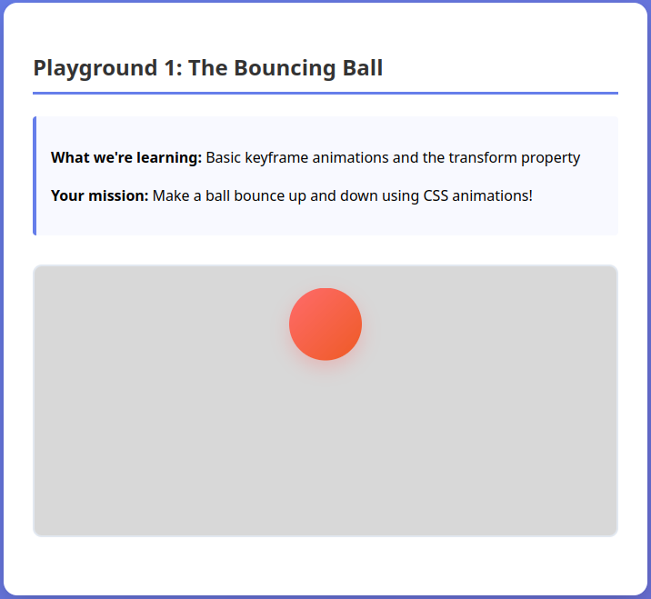
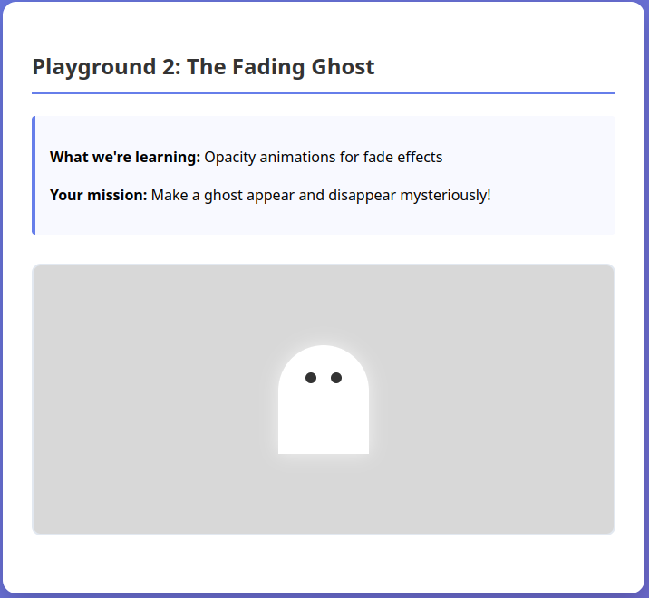
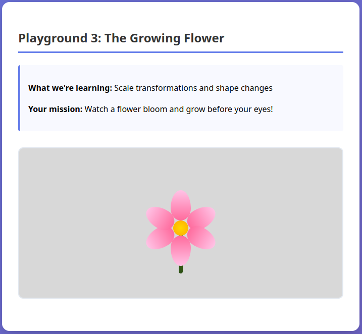
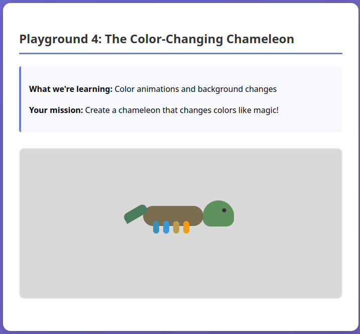
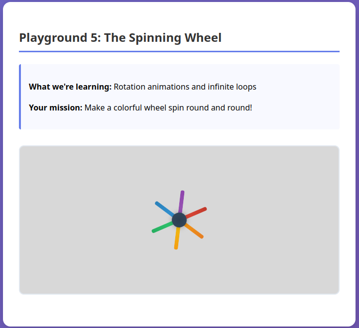
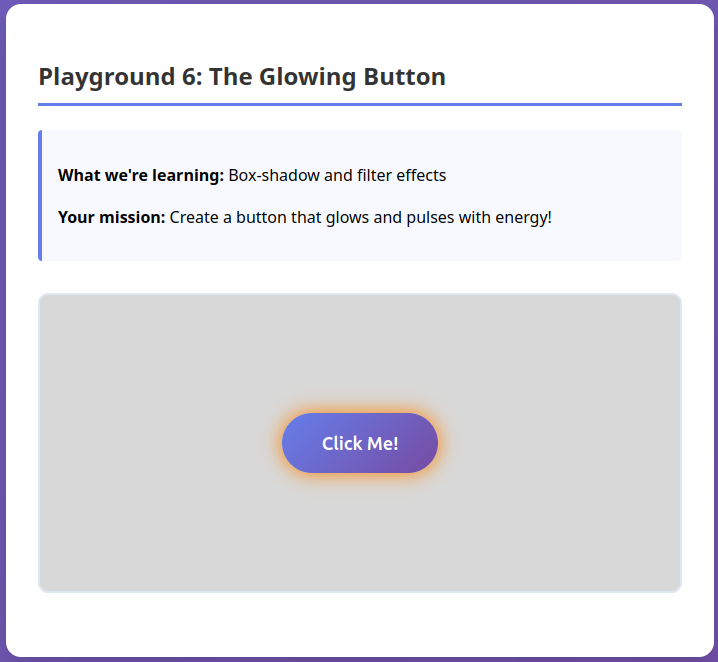
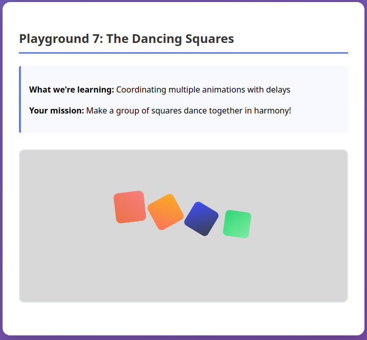

# Intro to CSS Animations Lab


Welcome to your first adventure with CSS animations! In this lab, you'll explore 7 different "playgrounds" where you'll learn to bring websites to life with movement, color changes, and visual effects.

## 🎯 What You'll Learn

By the end of this lab, you'll know how to:

- Create keyframe animations with `@keyframes`
- Animate position, size, rotation, and colors
- Control animation timing and repetition
- Coordinate multiple animations working together
- Use animations to enhance user experience

## 🚀 Getting Started

1. **Open the HTML file**: Start by opening `index.html` in your browser
2. **Follow the playgrounds in order**: Each one builds on the previous
3. **Read the CSS comments carefully**: They contain all your instructions
4. **Experiment freely**: Try changing values to see what happens!

## 🎪 The 7 Playgrounds

### Playground 1: The Bouncing Ball 🏀

**What you'll learn**: Basic keyframe syntax and transform animations

- File: `css/playground-1-bouncing-ball.css`
- Focus: `@keyframes`, `animation` property, `transform: translateY()`
- Time: ~20 minutes



### Playground 2: The Fading Ghost 👻

**What you'll learn**: Opacity animations and complex shapes

- File: `css/playground-2-fading-ghost.css`
- Focus: `opacity` animations, CSS shapes, positioning
- Time: ~20 minutes



### Playground 3: The Growing Flower 🌸

**What you'll learn**: Scale transformations and animation delays

- File: `css/playground-3-growing-flower.css`
- Focus: `transform: scale()`, `animation-delay`, coordinated timing
- Time: ~25 minutes



### Playground 4: The Color-Changing Chameleon 🦎

**What you'll learn**: Color animations and multi-part elements

- File: `css/playground-4-color-changing-chameleon.css`
- Focus: `background-color` animations, color transitions
- Time: ~25 minutes



### Playground 5: The Spinning Wheel ⚙️

**What you'll learn**: Rotation animations and infinite loops

- File: `css/playground-5-spinning-wheel.css`
- Focus: `transform: rotate()`, infinite animations, linear timing
- Time: ~20 minutes



### Playground 6: The Glowing Button ✨

**What you'll learn**: Visual effects with shadows and filters

- File: `css/playground-6-glowing-button.css`
- Focus: `box-shadow`, `filter: brightness()`, interactive effects
- Time: ~25 minutes



### Playground 7: The Dancing Squares 💃

**What you'll learn**: Complex multi-element coordination

- File: `css/playground-7-dancing-squares.css`
- Focus: Multiple animations, delays, choreographed effects
- Time: ~30 minutes



## 📝 How to Work Through Each Playground

1. **Read the introduction** at the top of each CSS file
2. **Look for TODO comments** - these show you exactly what to do
3. **Uncomment code** when instructed (remove the `/* */`)
4. **Fill in missing values** where you see `/* YOUR CODE HERE */`
5. **Save and refresh** your browser to see the changes
6. **Try the experiments** at the bottom of each file

## 🛠️ Common TODO Tasks

You'll encounter these types of tasks:

### Uncommenting Code

```css
/* TODO #1: Uncomment the line below */
/* animation: bounce 2s ease-in-out infinite; */
```

**What to do**: Remove the `/* */` around the line:

```css
animation: bounce 2s ease-in-out infinite;
```

### Filling in Values

```css
/* TODO #2: Fill in the translateY value */
transform: translateY(/* YOUR CODE HERE */);
```

**What to do**: Replace the comment with a value:

```css
transform: translateY(-100px);
```

### Choosing Options

```css
/* TODO #3: Choose a timing - try: 1s, 2s, or 3s */
animation-duration: /* YOUR CHOICE HERE */;
```

### Experimenting

There will be sections at the end of each playground where you can try your own ideas.

## 🔧 Getting Unstuck

### If your animation isn't working:

1. **Check syntax**: Make sure you have semicolons `;` at the end of lines
2. **Check spelling**: Animation names must match exactly
3. **Check comments**: Make sure you've uncommented the right lines
4. **Use browser tools**: Right-click → Inspect → Console to see errors

### If something looks wrong:

1. **Refresh the browser** after saving CSS changes
2. **Check the TODO numbers** - make sure you're doing them in order
3. **Read the instructions twice** - the details matter!

### If you're confused:

1. **Read the explanation sections** in each CSS file
2. **Try the suggested values first** before experimenting

## 📚 Key Concepts Review

### Animation Syntax

```css
.element {
  animation: name duration timing-function iteration-count;
}

@keyframes name {
  0% {
    /* start styles */
  }
  50% {
    /* middle styles */
  }
  100% {
    /* end styles */
  }
}
```

### Transform Functions

- `translateX(50px)` - move horizontally
- `translateY(-30px)` - move vertically
- `scale(1.5)` - make bigger/smaller
- `rotate(45deg)` - spin around

### Timing Control

- `animation-duration: 2s` - how long one cycle takes
- `animation-delay: 0.5s` - wait before starting
- `animation-iteration-count: infinite` - repeat forever
- `animation-timing-function: ease-in-out` - speed curve

## 🎉 Congratulations!

When you complete all 7 playgrounds, you'll have learned the fundamental building blocks of CSS animation. These skills will help you create more engaging, interactive, and delightful web experiences.

Remember: every professional web developer started exactly where you are now. Keep practicing, keep experimenting, and most importantly - have fun bringing the web to life!

---

**Time Estimate**: 3 hours total (including breaks and experimentation)  
**Difficulty**: Beginner-friendly with guided practice  
**Prerequisites**: Basic CSS knowledge (selectors, properties, values)
